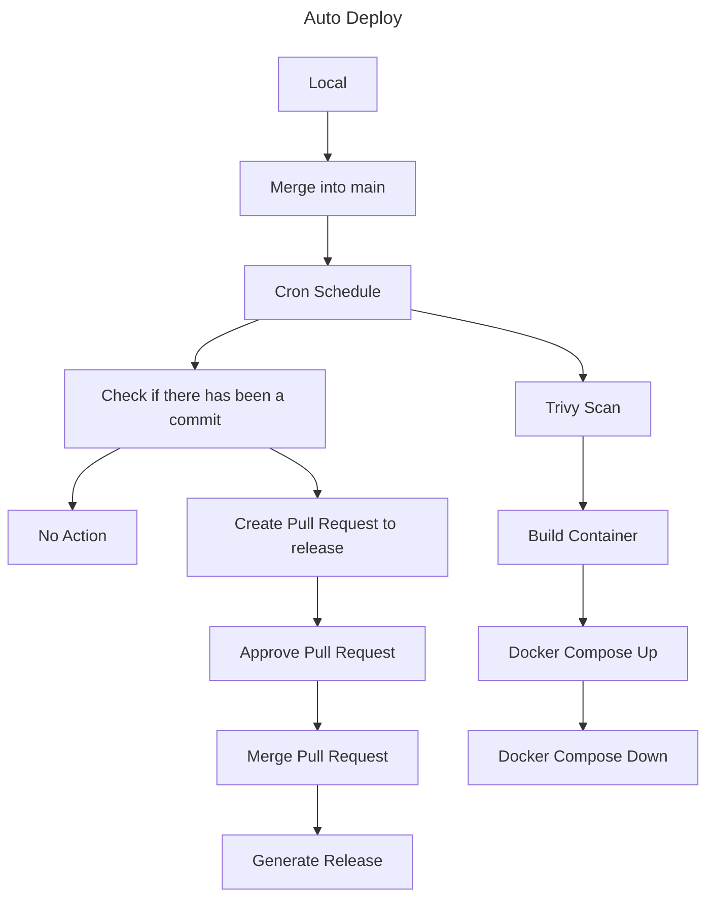

# Build and Publish Container

Note: This does not use an entrypoint.sh yet. Please view https://github.com/Bombarding/build-and-publish/blob/release/.github/workflows/ci.yml

```mermaid
---
title: Auto Deploy
---
graph TD;
    A[Local]-->B[Merge into main];
    C[Cron Schedule]-->D[Check if there has been a commit];
    B-->C;
    D-->E[No Action];
    D-->F[Create Pull Request to release];
    F-->G[Approve Pull Request];
    L-->I[Build Container];
    G-->H[Merge Pull Request];
    H-->M[Generate Release];
    I-->J[Docker Compose Up];
    J-->K[Docker Compose Down];
    C-->L[Trivy Scan];
```
