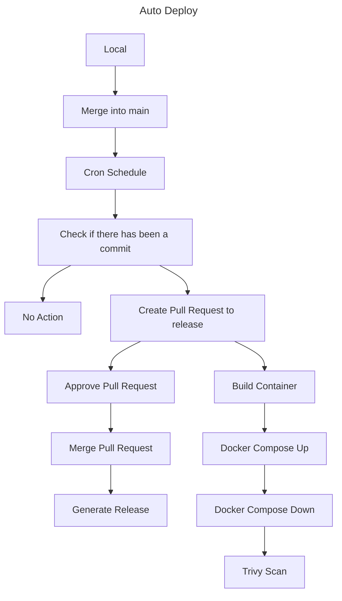

# Build and Publish

```mermaid
---
title: Auto Deploy
---
graph TD;
    A[Local]-->B[Merge into main];
    C[Cron Schedule]-->D[Check if there has been a commit];
    B-->C;
    D-->E[No Action];
    D-->F[Create Pull Request to release];
    F-->G[Approve Pull Request];
    F-->I[Build Container];
    G-->H[Merge Pull Request];
    H-->M[Generate Release];
    I-->J[Docker Compose Up];
    J-->K[Docker Compose Down];
    K-->L[Trivy Scan];
```
